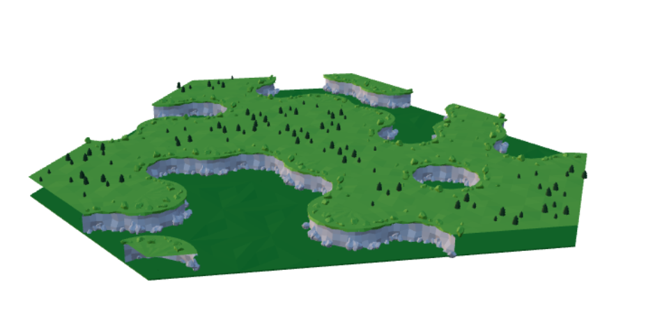
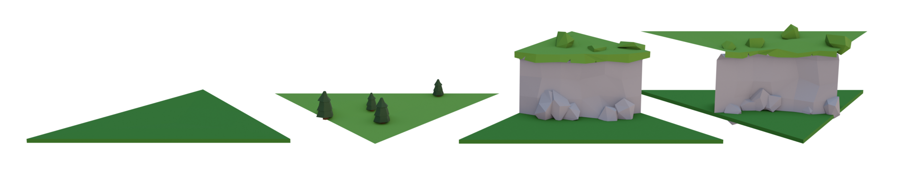

# Model Synthesizer with 3d triangular grid

This is a little demo of model synthesis / wave-function collapse running in the browser.

The tiles are triangular - this is nice because you only need to create very few tiles.

Read more about [triangular grids in Boris The Brave's blog post](https://www.boristhebrave.com/2021/05/23/triangle-grids/)

# Modelling tiles in blender

Make the tiles equilateral triangles with edge-length 1.

Ensure you apply all scale/rotation.

Export as glb - use gltfjsx to auto-generate component js files.

Look at the blend file in `public/assets/tiles.blend`
