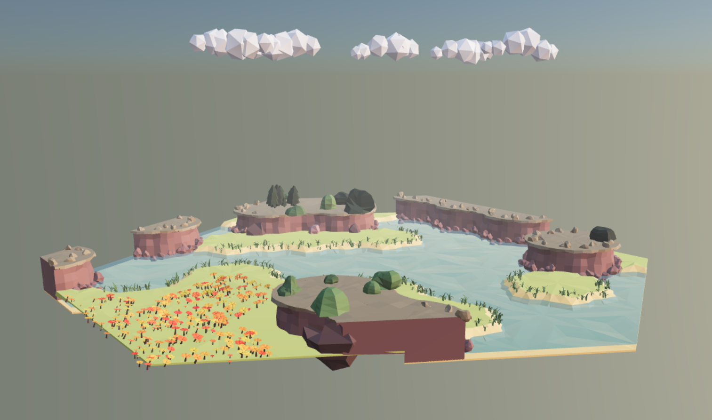

# Model Synthesizer with 3d triangular grid

[Demo!](https://gromgull.github.io/triangular-grid-model-synthesis-3d/)

This is a little demo of model synthesis / wave-function collapse running in the browser.

The tiles are triangular - this is nice because you only need to create very few tiles.

Read more about [triangular grids in Boris The Brave's blog post](https://www.boristhebrave.com/2021/05/23/triangle-grids/)

# Modelling tiles in blender

Make the tiles equilateral triangles with edge-length 1.

Ensure you apply all scale/rotation.

Look at the blend file in `public/assets/tiles.blend`

There is a python script that will export all collections to corresponding glb files. (in retrospect - why not use ONE glb file?)
